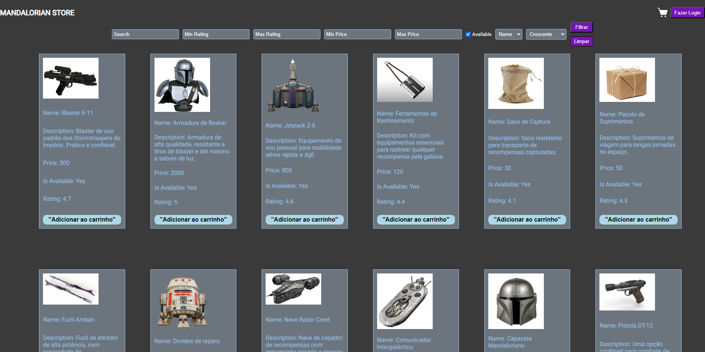

# Mandalorian Store (Front-End)

# Como foi o desenvolvimento do projeto?

Nesse projeto utilizei pela primeira vez Typescript com React e Next. Utilizei tambem pela primeira vez o conceito de Context API, no modelo de estrutura de pages do Next.
Em alguns componentes mantive uma pagina de module.css para estilização, porque reutilizei de outros projetos, mas em maioria utilizei Styled-Components, que consigo concentrar
o CSS e o TypeScript no mesmo codigo.

## Tecnologias Utilizadas
- **Next.js**: Framework utilizado para renderizar todo o projeto.
- **React**: Utilizado para a construção da interface do usuário.
- **TypeScript**: Linguagem utilizada para desenvolver o projeto.
- **Axios**: Biblioteca utilizada para realizar as requisições a API.
